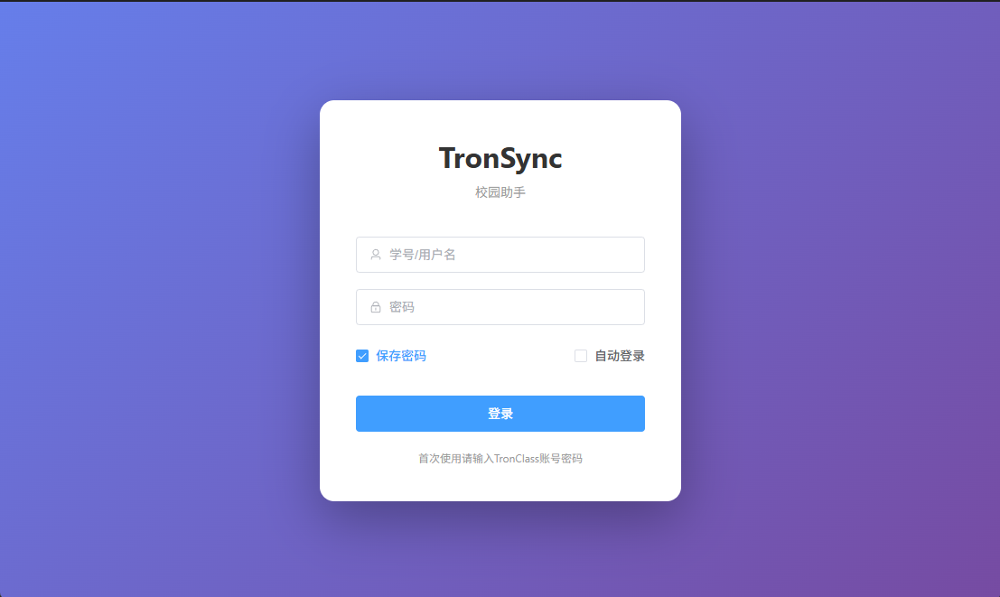
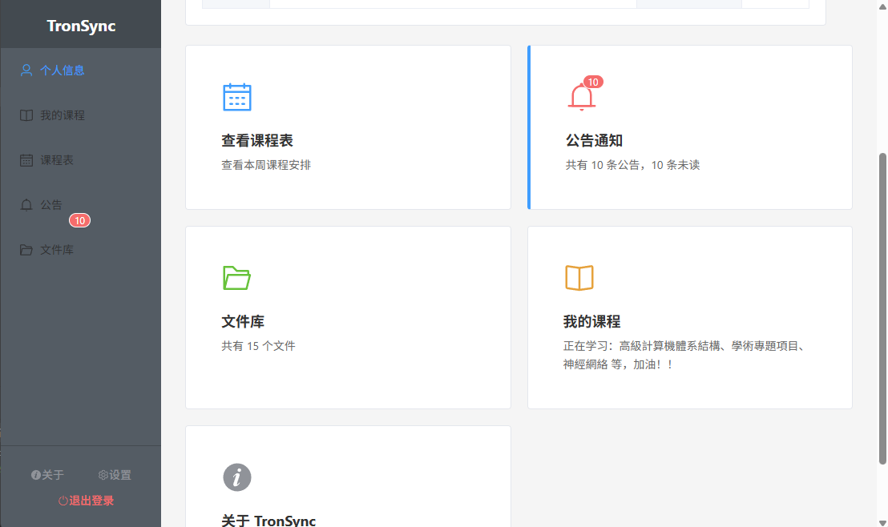
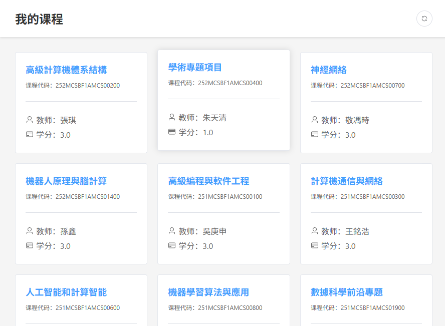
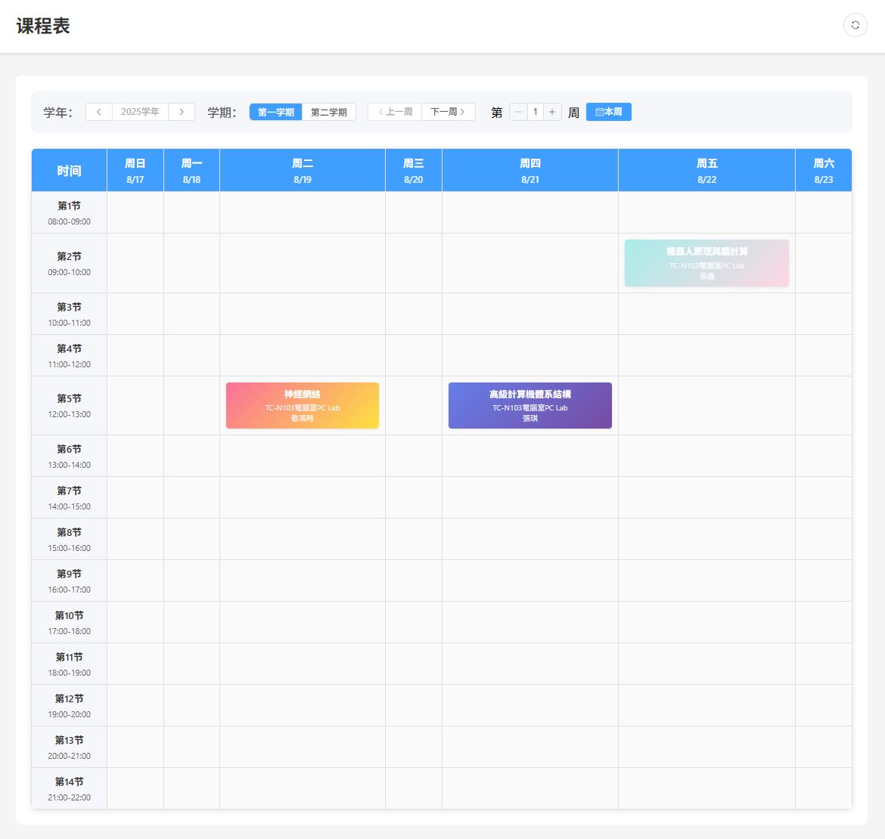
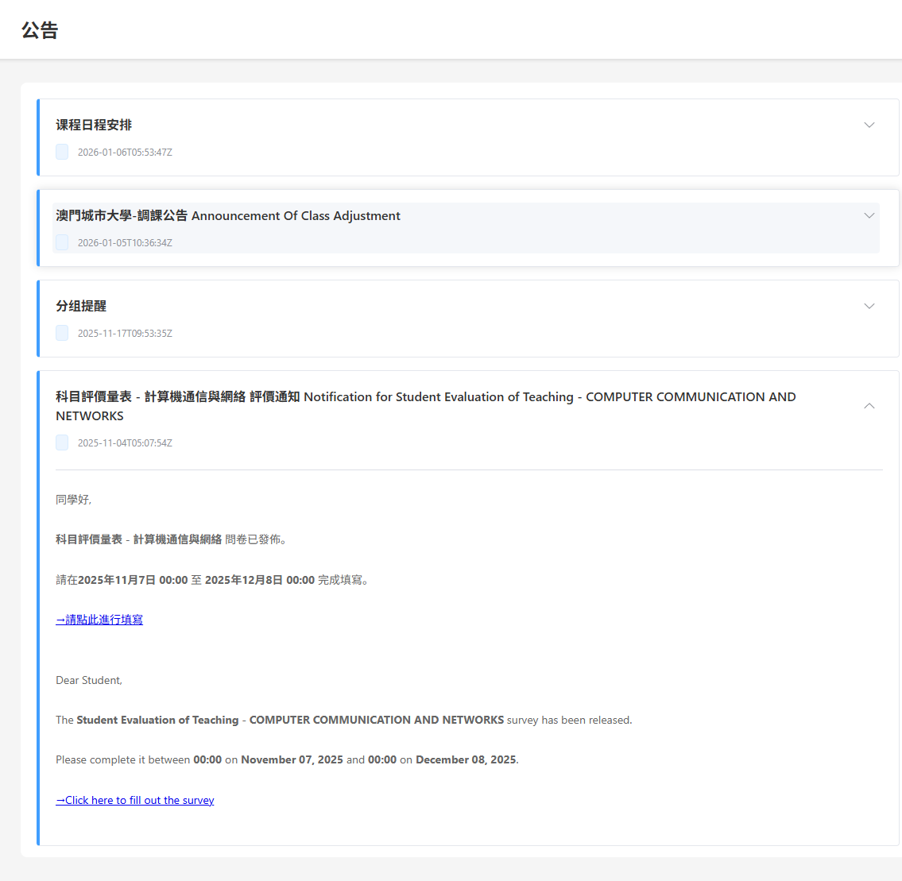
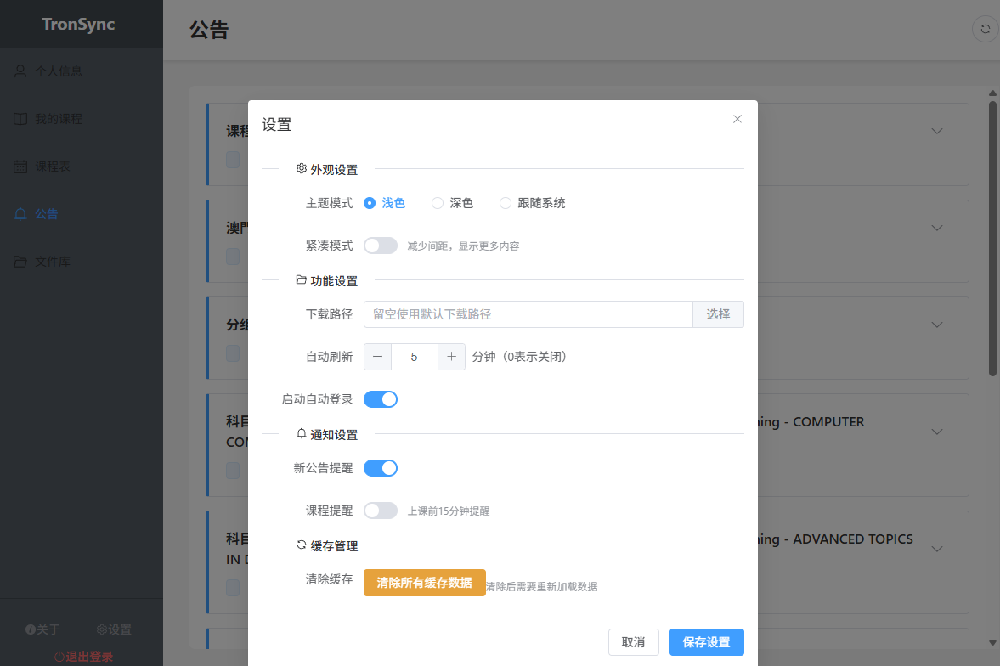

# TronSync - 澳门城市大学校园助手

## 简介

TronSync 是一个基于tronclass网站的，专门为澳门城市大学学生设计的桌面应用，以更便捷的方式使用原版Tronclass功能。

如果本项目对你有帮助，请给一个 ⭐ Star！
如果你有功能要求，bug，漏洞汇报，非常欢迎在issues内提出，这会给我更多更新动力！

## 注意：如果启动时遇到窗口白屏或报错
双击 `运行不了双击这里.bat` 按提示修复运行环境，这最多花费2分钟和占用大约10m的存储空间
---

## 📸 截图预览

<p align="center">
  
  
  
</p>
<p align="center">
  
  
  
</p>

---

## 功能特性

- 📚 **课程管理**：查看所有课程信息
- 📅 **智能课程表**：支持学年/学期/周数切换，显示具体日期
- 📢 **公告通知**：实时查看公告，未读提醒
- 📁 **文件管理**：浏览和下载课程文件
- 👤 **个人信息**：查看个人资料和快捷入口
- ⚙️ **个性化设置**：主题切换、下载路径设置等
- 💾 **数据缓存**：减少网络请求，提升使用体验
- 😈 **用户支持**：仅支持学生账号登陆
- 更多功能开发中......

## 系统要求

- Windows 10/11
- 澳门城市大学 TronClass 账号  学生版

## 安装使用

### 首次使用

1. 解压release内的 zip 文件到任意目录
2. 确保exe文件与_internal文件夹在统一目录内
2. 双击运行 `TronSync.exe`
3. 使用 TronClass 账号密码登录
4. 开始使用！

### 配置说明

- **自动登录**：勾选"保存密码"和"自动登录"，下次启动自动登录
- **下载路径**：在设置中可自定义文件下载位置


## 使用提醒

⚠️ **重要提示**：

- 请勿频繁刷新数据（建议间隔 5 分钟以上）
- 请勿在短时间内重复登录
- 请妥善保管您的账号密码
- 本应用仅供个人学习使用

## 常见问题

### 1. 无法登录

- 检查网络连接
- 确认账号密码正确
- 尝试在浏览器中登录 TronClass 确认账号状态

### 2. 数据加载失败

- 检查网络连接
- 点击刷新按钮重新加载
- 在设置中清除缓存后重试
- 频繁的数据请求触发了反爬程序，等待一段时间或更换代理地址重新请求

### 3. 文件下载失败

- 检查下载路径是否有写入权限
- 确认磁盘空间充足
- 尝试更换下载路径

### 4. 杀毒软件拦截

- 将 TronSync.exe 添加到杀毒软件白名单
- 本应用安全无毒，所有数据保存在本地，请放心使用

## 技术栈

- **前端**：Vue 3 + Element Plus
- **后端**：Flask + BeautifulSoup
- **桌面框架**：PyWebView
- **打包工具**：PyInstaller

## 开发者

如果您是开发者，需要自行编译或创建分支，请参考 /QUICKSTART.md  与  /CONTRIBUTING.md

## 更新日志

### v1.0.0 (2025-01-16)

- 🎉 首次发布
- ✨ 完整的课程管理功能
- ✨ 智能课程表（支持学年/学期/周数切换）
- ✨ 公告未读提醒
- ✨ 文件浏览和下载
- ✨ 主题切换（浅色/深色）
- ✨ 个性化设置

### v1.1.0 (2025-01-19)

- 增加联系方式页面，通过关键字快速检索老师，部门，学院的联系方式信息
- 在“关于“处添加了更新功能，以版本号区分版本，提供快速方便的更新方法，不支持v1.0.0版本，将在v1.2.0时发挥实际效果（beta）
- 优化了深浅切换，增加了主题颜色切换（beta）
- 增加了更多的动画效果，如加载，页面淡入淡出，水波纹切换主题
- 优化代码压缩，冗余代码等
- 制作了自定义的窗口边框，并引用cyptes，增强界面的一致性

## 更新计划

### v1.?.? (2025-0?-?)

- 计划添加以下功能：
  - 文件编辑，实装文件的上传，重命名功能
  - 前端优化，使用自定义窗口边框，增加一致性，扩充更多主题
  - 语言扩充，支持英语和繁体中文
  - 更智能的课程表，目前的课程表是自动生成并填充的，无法适应调课，假期等，正在寻找课程表相关api
  - 安卓端开发
  - 文件阅读器实现，以缓存的方式在线阅读文件和课程资料内的影片，pdf，文档等，设置合理的缓存保存时间以 及上限
  - 扩充更多基础功能，如论文库，培养计划等


## 开发

### 克隆项目

```bash
git clone https://github.com/你的用户名/TronSync.git
cd TronSync
```

### 安装依赖

```bash
# Python 依赖
pip install -r requirements.txt

# 前端依赖
cd frontend
npm install
cd ..
```

### 配置

复制配置文件模板：
```bash
copy config.json.example config.json
```

### 运行开发环境

```bash
# 1. 启动前端开发服务器
cd frontend
npm run dev

# 2. 在另一个终端启动后端
python app.py

# 3. 或者直接运行桌面应用
python run.py
```

### 打包

参考 [QUICKSTART.md](QUICKSTART.md) 了解详细的打包流程。

## 反馈与支持

- **GitHub Issues**：[提交问题和建议](https://github.com/你的用户名/TronSync/issues)
- **Pull Requests**：欢迎贡献代码

## 免责声明

本应用仅供学习交流使用，请合理使用，尊重学校网站资源。应用不提供任何个人数据，开发者不对使用本应用造成的任何后果负责。

## 开源协议

[MIT License](LICENSE)

---

Made with ❤️ for CityU Students
